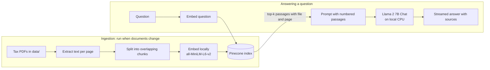

# IndianTaxGPT

**Ask questions about Indian income tax and get answers grounded in the actual law, with the
page they came from.**

[](https://github.com/NitinReddy-A/IncomeTAXGPT/actions/workflows/ci.yml)


IndianTaxGPT is a question-answering assistant for Indian income tax. You give it the documents
that matter: the Income-tax Act, the Rules, CBDT circulars and the department's taxpayer guides.
It answers questions in plain language from those documents, and every answer lists the file and
page it relied on so you can check it.

The language model runs on your own machine. There is no per-question API bill, and the text of
your questions is never sent to an AI provider.

---

## The problem

More than 7 crore income tax returns are filed in India every year, and most of the people filing
them are not tax professionals. When a question comes up, such as whether a deduction applies,
which form to use, or when advance tax is due, the usual options are poor:

- **Read the Act yourself.** It is long, heavily cross-referenced and amended every year through
  the Finance Act.
- **Search the web.** Blogs and forums are often outdated or wrong, and rarely say which version
  of the law they describe.
- **Ask a general-purpose chatbot.** It answers from whatever it saw in training. It may describe
  rules that have since changed, and it can't show you where an answer came from.
- **Pay a chartered accountant.** That is the right call for real decisions, but expensive for
  routine "what does the rule say" questions.

## What IndianTaxGPT does differently

| | |
|---|---|
| **Answers from the source** | The model sees only passages retrieved from your indexed documents and is instructed to answer from them, and to say it doesn't know when they don't cover the question. |
| **Citations on every answer** | Each response lists the documents and page numbers it used, with the matching excerpt, so you can verify it in seconds. |
| **Easy to keep current** | Tax law changes every Budget. Updating the assistant means replacing PDFs and re-running ingestion. There is no retraining. |
| **Private and low cost** | The LLM and the embedding model run locally on a CPU. Only the question's embedding vector goes to the vector database. The free Pinecone plan is enough for a typical document set. |

### Who it is for

| User | Typical question | How it helps |
|------|------------------|--------------|
| Salaried individuals and freelancers | "Can I claim HRA and a home-loan deduction together?" | Plain-language answers before filing, with the relevant section to read. |
| Small business owners | "When do I have to pay advance tax?" | Quick lookups without booking a consultation for every question. |
| Accountants and CA firms | "What did the latest circular say about this deduction?" | An internal research tool over the firm's own set of Acts, rules and circulars. |
| Students preparing for tax exams | "Explain how income from house property is computed." | Answers tied to the text of the Act rather than secondary notes. |

### Keeping up with the law

The Income-tax Act, 2025 replaces the Income-tax Act, 1961 from 1 April 2026. This is the kind of
change a document-grounded assistant handles well: add the new Act to `data/`, run
`python -m indiantaxgpt.ingest --reset`, and answers now come from the new text, cited to it.
To answer questions about earlier years too, keep both Acts in the index.

---

## How it works

IndianTaxGPT uses retrieval-augmented generation (RAG). Documents are split into passages and
indexed once. For each question, the most relevant passages are retrieved and handed to the
model with instructions to answer only from them.



### Technical choices

| Component | Choice | Why |
|-----------|--------|-----|
| LLM | Llama 2 7B Chat, 4-bit GGUF, run with [ctransformers](https://github.com/marella/ctransformers) | Runs on a laptop with 8 GB RAM. No GPU and no API key needed. |
| Embeddings | `sentence-transformers/all-MiniLM-L6-v2` (384-dim) | Small, fast on CPU and good at short-passage retrieval. |
| Vector store | Pinecone serverless, cosine similarity | Managed, and the free plan covers a full Act plus rules and circulars. |
| Chunking | 1,000 characters with 150 overlap, recursive splitter | Keeps most sub-sections intact while fitting several passages into the 4k context window. |
| Retrieval | Top 4 passages | Enough context for most questions while leaving room for the answer. |
| Generation | Temperature 0.1, Llama 2 chat prompt format, "answer only from context" system prompt | Favours faithful, repeatable answers over creative ones. |
| Ingestion | Deterministic chunk IDs (hash of file, page, offset and text) | Re-running ingestion updates vectors in place instead of duplicating them. |
| UI | Streamlit chat with token streaming | Text appears as it is generated, which matters with CPU inference. |

All of these settings can be changed through environment variables (see [Configuration](#configuration)).

---

## Getting started

### Prerequisites

- Python 3.11 or newer
- About 8 GB of RAM and 5 GB of disk space for the default model
- A free [Pinecone](https://app.pinecone.io) account and API key

### 1. Install

```bash
git clone https://github.com/NitinReddy-A/IncomeTAXGPT.git
cd IncomeTAXGPT
python -m venv .venv
source .venv/bin/activate        # Windows: .venv\Scripts\activate
pip install -e .
```

On Linux, add `--extra-index-url https://download.pytorch.org/whl/cpu` to the install command to
get the CPU-only build of PyTorch instead of the much larger CUDA build.

### 2. Configure

```bash
cp .env.example .env             # Windows: copy .env.example .env
```

Open `.env` and set `PINECONE_API_KEY`. Everything else has sensible defaults.

### 3. Download the model (~4.1 GB)

```bash
python -m indiantaxgpt.download_model
```

See [models/README.md](models/README.md) for larger, higher-quality variants.

### 4. Add documents and build the index

Put tax PDFs in `data/`. [data/README.md](data/README.md) lists free official sources.

```bash
python -m indiantaxgpt.ingest --dry-run   # check what will be indexed
python -m indiantaxgpt.ingest             # embed and upload to Pinecone
```

The index is created automatically on the first run.

### 5. Run the app

```bash
streamlit run app.py
```

Open http://localhost:8501 and ask a question.

---

## Configuration

All settings are read from environment variables or `.env`. See [.env.example](.env.example).

| Variable | Default | Description |
|----------|---------|-------------|
| `PINECONE_API_KEY` | (required) | Pinecone API key |
| `PINECONE_INDEX_NAME` | `indiantaxgpt` | Index to read from and write to |
| `PINECONE_CLOUD` / `PINECONE_REGION` | `aws` / `us-east-1` | Where a new serverless index is created |
| `EMBEDDING_MODEL` | `sentence-transformers/all-MiniLM-L6-v2` | Any sentence-transformers model. Re-ingest with `--reset` after changing it. |
| `LLM_MODEL_PATH` | `models/llama-2-7b-chat.Q4_K_M.gguf` | Path to the GGUF model file |
| `LLM_MODEL_TYPE` | `llama` | ctransformers model type |
| `LLM_MAX_NEW_TOKENS` | `512` | Maximum answer length in tokens |
| `LLM_TEMPERATURE` | `0.1` | Lower is more deterministic |
| `LLM_CONTEXT_LENGTH` | `4096` | Model context window |
| `DATA_DIR` | `data` | Folder scanned for PDFs |
| `CHUNK_SIZE` / `CHUNK_OVERLAP` | `1000` / `150` | Chunking, in characters |
| `RETRIEVER_K` | `4` | Passages retrieved per question |

## Project structure

```
IncomeTAXGPT/
├── app.py                      # Streamlit entry point
├── indiantaxgpt/
│   ├── config.py               # Settings loaded from env / .env, with validation
│   ├── ingest.py               # PDF loading, chunking, embedding, upsert (CLI)
│   ├── assistant.py            # Retrieval + generation pipeline, source citations
│   ├── prompts.py              # System prompt and Llama 2 chat template
│   ├── llm.py                  # ctransformers model wrapped as a streaming LangChain LLM
│   ├── embeddings.py           # Sentence-transformers embeddings
│   ├── vectorstore.py          # Pinecone index creation and connection
│   ├── download_model.py       # Fetches GGUF weights from Hugging Face (CLI)
│   └── ui.py                   # Chat interface
├── tests/                      # Unit tests; no network, API keys or model downloads needed
├── data/                       # Your PDFs (git-ignored)
└── models/                     # Model weights (git-ignored)
```

## Development

```bash
pip install -e ".[dev]"
pytest              # unit tests, including the Streamlit UI via AppTest
ruff check .        # lint
ruff format .       # format
```

The tests replace Pinecone, the LLM and the retriever with fakes, so they run in seconds offline.
CI runs lint and tests on Python 3.11 and 3.12 for every push and pull request.

---

## Limitations

These matter, and being upfront about them is part of making the tool trustworthy:

- **It only knows what you index.** Questions outside the documents should get "I don't know".
  Answer quality depends on choosing good, current sources.
- **Grounding is instructed, not guaranteed.** The model is told to answer only from the retrieved
  passages, but a small model can still blend in outside knowledge. That is why the sources are
  always shown.
- **A 7B model has limits.** Llama 2 7B handles lookups and explanations well. It is weaker at
  multi-step calculations, so don't rely on it to compute your tax liability.
- **CPU inference is slow.** Depending on hardware, an answer can take from tens of seconds to a
  couple of minutes. Streaming helps, but this is not instant.
- **Each question stands alone.** The chat keeps history on screen, but follow-up questions are not
  yet rewritten with earlier context.
- **No OCR.** Scanned PDFs without a text layer are skipped during ingestion.
- **Pure semantic search can miss exact references.** A query like "section 80TTB" may retrieve
  related but different sections. Hybrid search is on the roadmap.

## Roadmap

- [ ] Hybrid retrieval (BM25 + vectors) so exact section numbers and form names match reliably
- [ ] Metadata filters by Act, assessment year and document type
- [ ] Pluggable LLM backends (Ollama / llama.cpp server, or a hosted API) alongside local ctransformers
- [ ] Follow-up questions that use conversation history
- [ ] A small evaluation set of question/answer pairs to measure retrieval and answer quality
- [ ] OCR for scanned circulars and notifications
- [ ] Questions in Hindi and other Indian languages via multilingual embeddings

## Background

IndianTaxGPT started in 2023 as a hackathon prototype exploring whether open-source models could
make Indian tax law easier to navigate without paid APIs. It has since been rebuilt as a
maintained project. The rebuild added a modular package, current LangChain and Pinecone APIs,
source citations, idempotent ingestion, a streaming chat UI, tests and CI.

## Disclaimer

IndianTaxGPT is an information tool, not a tax advisor. Answers can be incomplete, out of date or
wrong. Always check the cited source, and consult a qualified chartered accountant before acting
on anything that affects your tax return.

## License

[MIT](LICENSE)
